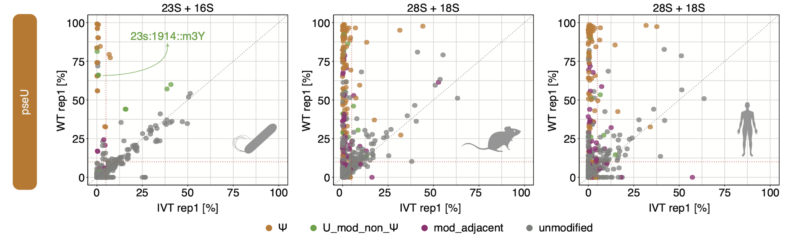

# ONT_basecalling_models
Benchmarking of ONT basecalling models for RNA modification detection 

# Citation
If you find this work/code useful, please cite the manuscript: 

Diensthuber G, Milenkovic I, Llovera L, Milovanovic A, Pelizzari F and Novoa EM. **Systematic benchmarking of basecalling models for RNA modification detection with highly-multiplexed nanopore sequencing** (in preparation). 

